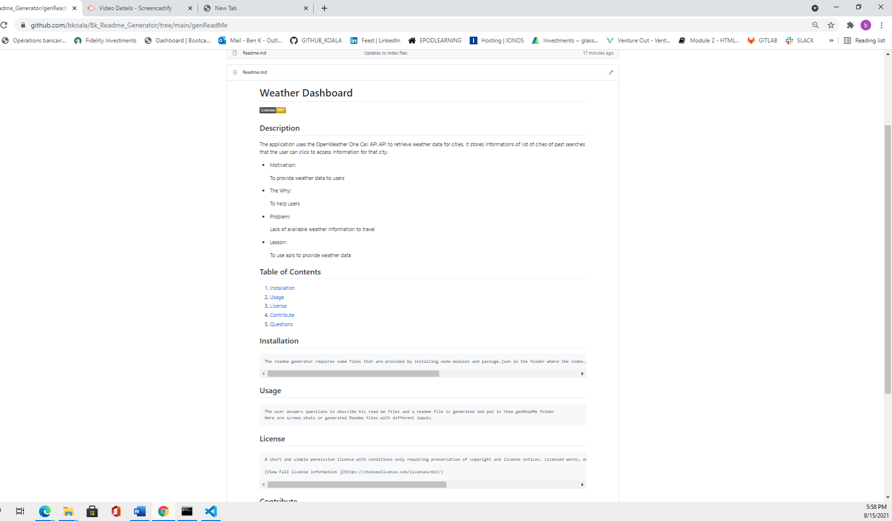

# Professional README Generator

## Description

The application is used to generate readme files after the user respond to questions related to his project.  The application is invoked by using the following command: `node index` 

The user is prompted for information about his application repository
and the answers are used to generate a high-quality, professional README.md with the title of my project and sections entitled Description, Table of Contents, Installation, Usage, License, Contributing, Tests, and Questions. The readme file generated is stored in the genReadMe folder.
In addtion the title, a description and usage information along with contribution guidelines are displayed.  A license is chosen for the application and a badge is added. The user github link information and the user email address are also displayed.
The questions are implemented using the [Inquirer package](https://www.npmjs.com/package/inquirer).

Application Page Link :https://bkoala.github.io/Bk_Readme_Generator/

Application Screen Shot :
